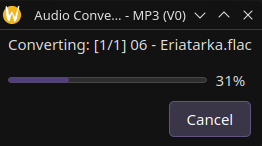
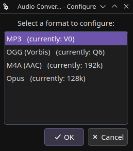
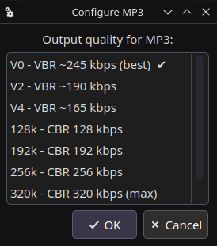

# dolphin-audio-converter

A KDE/Dolphin service menu for converting audio and video files to common audio formats using ffmpeg. Right-click any audio or video file in Dolphin and convert it without leaving the file manager.


## Features

- **7 output formats** - MP3, OGG (Vorbis), FLAC, WAV, M4A (AAC), Opus, ALAC
- **Configurable quality** - VBR/CBR grades for lossy formats; menu labels update live to reflect your settings (e.g. `Convert to MP3 (V0)`)
- **Cancel mid-batch** - hitting Cancel kills ffmpeg cleanly and removes the partial output file
- **Lossy conversion warnings** - ffprobe detects the source codec and warns before a lossy→lossy or lossy→lossless conversion
- **Desktop notification** on completion (via `notify-send`)
- Supports **Plasma 5 and Plasma 6** (auto-detects the correct service menu directory)
- No root required - installs entirely to `~/.local`

## Requirements

| Tool                 | Required    | Notes                                          |
| -------------------- | ----------- | ---------------------------------------------- |
| `python3`            | ✅ Yes      | 3.10+ for `match`-free type hints              |
| `ffmpeg` + `ffprobe` | ✅ Yes      | The actual encoder                             |
| `kdialog`            | ✅ Yes      | Dialogs and progress bar                       |
| `qdbus` / `qdbus6`   | Recommended | Animates the progress bar; also detects Cancel |
| `notify-send`        | Optional    | Completion desktop notification                |

Install missing tools on common distros:

```bash
# Debian / Ubuntu / Mint
sudo apt install ffmpeg kdialog qdbus libnotify-bin

# Fedora
sudo dnf install ffmpeg kdialog qt5-qttools libnotify

# Arch / Manjaro
sudo pacman -S ffmpeg kdialog qt5-tools libnotify

# openSUSE
sudo zypper install ffmpeg kdialog libqt5-qttools libnotify-tools
```

## Installation

### Method 1: Install with Dolphin (Recommended)

1. Open Dolphin
2. Click the Burger Menu -> Configure -> Configure Dolphin...
3. Click on "Content Menu" in the left sidebar
4. Click on "Download New Services..."
5. Search for "Audio Converter"
6. Click "Install"

### Method 2: GitHub Release

1. Download the latest release from the [Releases page](https://github.com/SavageCore/dolphin-audio-converter/releases/latest).
2. Extract the archive.
3. Run `install.sh`.

```bash
tar -xvf dolphin-audio-converter-*.tar.gz
cd dolphin-audio-converter-*
./install.sh
```

### Method 3: KDE Store

1. Download the archive from [KDE Store](https://www.pling.com/p/2348602/)
2. Extract the archive.
3. Run `install.sh`.

### Method 4: Git (Development)

```bash
git clone https://github.com/SavageCore/dolphin-audio-converter.git
cd dolphin-audio-converter
chmod +x install.sh
./install.sh
```

The installer will:

1. Check for required dependencies (and warn about optional ones)
2. Copy the backend script to `~/.local/bin/dolphin-audio-converter`
3. Install the service menu to the correct location for your Plasma version
4. Rebuild the KDE service cache (`kbuildsycoca5` or `kbuildsycoca6`)
5. Apply any previously saved quality settings to the menu labels

After installation, right-click any audio or video file in Dolphin and look for the **Audio Converter** submenu.

## Usage

### Converting files

Right-click one or more audio/video files → **Audio Converter** → choose a format.


A progress dialog opens showing `[1/3] filename.flac` style labels. The bar sweeps from 0–100% across the entire batch without flickering between files. Hitting **Cancel** stops the current encode, removes the partial output file, and exits.



Output files are written to the same directory as the source with the new extension. If the output path would overwrite the source (e.g. converting a `.flac` to `.flac`), `_flac` is appended to the stem before writing.


### Configuring quality

Right-click → **Audio Converter** → **Configure…**

Select a format, then select a quality preset. The service menu label for that format updates immediately - no restart required.




#### Quality options

| Format       | Options                            | Default            |
| ------------ | ---------------------------------- | ------------------ |
| MP3          | V0, V2, V4, 128k, 192k, 256k, 320k | V0 (VBR ~245 kbps) |
| OGG (Vorbis) | Q3, Q5, Q6, Q8, Q10                | Q6 (~192 kbps)     |
| M4A (AAC)    | 128k, 192k, 256k, 320k             | 192k               |
| Opus         | 64k, 96k, 128k, 192k, 256k         | 128k               |
| FLAC         | lossless                           | -                  |
| WAV          | lossless (PCM 16-bit)              | -                  |
| ALAC         | lossless                           | -                  |

Settings are saved to `~/.config/dolphin-audio-converter/config.json`.

### Lossy conversion warnings

If ffprobe detects that the source file uses a lossy codec, you'll be prompted before encoding begins:

- **Lossy → Lossy** (e.g. MP3 to OGG): warns that re-encoding degrades quality further
- **Lossy → Lossless** (e.g. MP3 to FLAC): warns that the quality loss is already baked in and the output will just be larger

You can proceed or cancel per-file.

## Files

```
dolphin-audio-converter.py     # Python backend (goes to ~/.local/bin/)
dolphin-audio-converter.desktop  # KDE service menu definition
install.sh                     # Installer
```

## Uninstalling

```bash
rm ~/.local/bin/dolphin-audio-converter
rm ~/.local/share/kio/servicemenus/dolphin-audio-converter.desktop      # Plasma 6
# or
rm ~/.local/share/kservices5/ServiceMenus/dolphin-audio-converter.desktop  # Plasma 5
rm -rf ~/.config/dolphin-audio-converter

# Rebuild the service cache
kbuildsycoca6 --noincremental   # or kbuildsycoca5
```

## How it works

The backend is a single Python script invoked by the `.desktop` file with `--format <fmt>` and the selected file paths. Progress is tracked by passing `ffmpeg -progress <tempfile>` instead of reading from a pipe - reading from a pipe on the same thread would block the `qdbus` calls that animate the dialog. A polling loop reads the temp file every 500ms, maps `out_time_ms` against the total duration to compute a percentage, and drives the progress bar via `qdbus`. If `qdbus` returns exit code 1 (the dialog was closed), ffmpeg is killed and the partial output is cleaned up.

The `--configure` flag opens a two-step `kdialog --menu` to pick a format and quality, then writes the result to the JSON config file and patches the `Name=` lines in the installed `.desktop` file in-place so the menu reflects the new setting immediately.

## Development

### Prerequisites

- [uv](https://docs.astral.sh/uv/) (recommended) or pip
- [pre-commit](https://pre-commit.com/)

### Setup

Using `uv` (recommended):

```bash
# Install dependencies
uv sync

# Install pre-commit hooks
uv run pre-commit install
```

Using `pip`:

```bash
# Install dependencies
pip install pre-commit ruff

# Install pre-commit hooks
pre-commit install
```

### Linting

Run the linter manually:

```bash
# Check for issues
uv run ruff check .

# Fix auto-fixable issues
uv run ruff check --fix .

# Format code
uv run ruff format .
```

### Packaging for KDE Store

To create a `.tar.gz` bundle for the KDE Store:

```bash
tar --transform 's,^,dolphin-audio-converter/,' -czvf dolphin-audio-converter.tar.gz \
    dolphin-audio-converter.py \
    dolphin-audio-converter.desktop \
    install.sh
```

---

## Acknowledgements

Progress bar technique adapted from the [download-with-yt-dlp-here](https://github.com/fabiomux/kde-servicemenus) KDE service menu by Fabio Mucciante.

## License

MIT - see [LICENSE](LICENSE).
